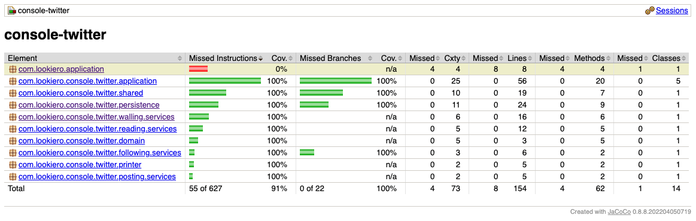

ConsoleTwitter
========================

Implement a console-based social networking application (similar to Twitter) satisfying the scenarios below.

<h2>Scenarios</h2>

Posting: Alice can publish messages to a personal timeline

```
> Alice -> I love the weather today
> Bob -> Damn! We lost!
> Bob -> Good game though.
```

Reading: Bob can view Alice’s timeline

```
> Alice
I love the weather today (5 minutes ago)
> Bob
Good game though. (1 minute ago)
Damn! We lost! (2 minutes ago)
```

Following: Charlie can subscribe to Alice’s and Bob’s timelines, and view an aggregated list of all subscriptions

```
> Charlie -> I'm in New York today! Anyone want to have a coffee?
> Charlie follows Alice
> Charlie wall
Charlie - I'm in New York today! Anyone want to have a coffee? (2 seconds ago)
Alice - I love the weather today (5 minutes ago)

> Charlie follows Bob
> Charlie wall
Charlie - I'm in New York today! Anyone wants to have a coffee? (15 seconds ago)
Bob - Good game though. (1 minute ago)
Bob - Damn! We lost! (2 minutes ago)
Alice - I love the weather today (5 minutes ago)
```

<h2>Details</h2>

* The application must use the console for input and output.
* Users submit commands to the application.
* There are four commands. “posting”, “reading”, etc. are not part of the commands.
* Commands always start with the user’s name.
* posting: user name -> message
* reading: user name
* following: user name follows another user
* wall: user name wall

<h3>How to run the application</h4>

To run the app, follow the next steps:

1. Build the project:

   To build the project, execute the next command:

   ```cmd
   gradlew clean build
   ```

2. Generate the Docker image:

   To generate a Docker image with "console-twitter" name after build the project, execute the next command:

   ```shell
   docker build -t console-twitter .
   ```

3. Run the Docker image:

   To run the Docker image "console-twitter" after generate the Docker image, execute the next command:

   ```shell
   docker run -i -t console-twitter
   ```

<h2>What we are looking for: </h2>

* Use the language you feel more comfortable.
* Don't use any framework, we want to see you code.
* Pay attention about how your code is organized.
* How you are reflecting the domain in the code.
* We love clean code.
* We don`t think 100% of code coverage is a must, but we love tests.
* We are looking forward to seeing your code and discuss with you your solution.

<h2>Assumptions</h2>

* The resolution for "time ago" for posts only goes from seconds up to days due to a limitations in java implementation. If the time
  between posting and reading is less than a second, the time ago is "now".
* The username is case-sensitive and cannot contain any spaces.
* The user interface of the application has a fixed language: English (i.e. the time ago for the posts will only be displayed in English).
* User input is not parsed to prevent malicious code injection.
* Persistence has been implemented in memory map. This implementation could have problems with concurrency.
* Any type of unknown command causes the application to exit.
* A user cannot follow himself.

<h2>Improvements</h2>

* It would be possible to implement some kind of [specification pattern](https://www.martinfowler.com/apsupp/spec.pdf) to have a more
  flexible and robust access to the posts (i.e. It would be possible to add sort orders and more filters if necessary).
* User input could be parsed to prevent malicious code injection.
* Persistence could be implemented in a non-volatile system, like database.

<h2>Coverage</h2>
16-Oct-2022

